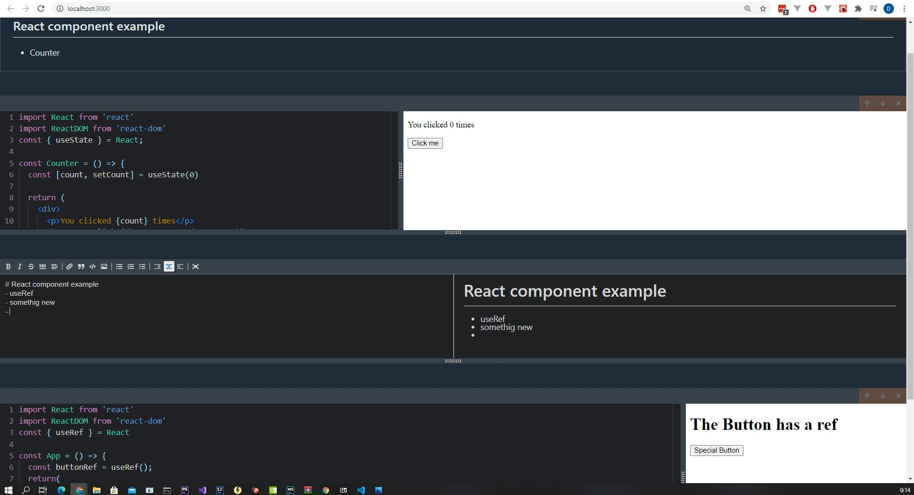

# React Notepad

## Interactive development environment for writing + document code.
- | typescript | react | redux | esbuild | webassembly |
- fetching any dependencies and bundle it runtime in a browser with webassembly esbuild binary
- transpiling jsx code into to native javascript with babel
- reformat code runtime use the prettier

## work still in progress

## App overview

### start app
`npm run start | yarn start`

